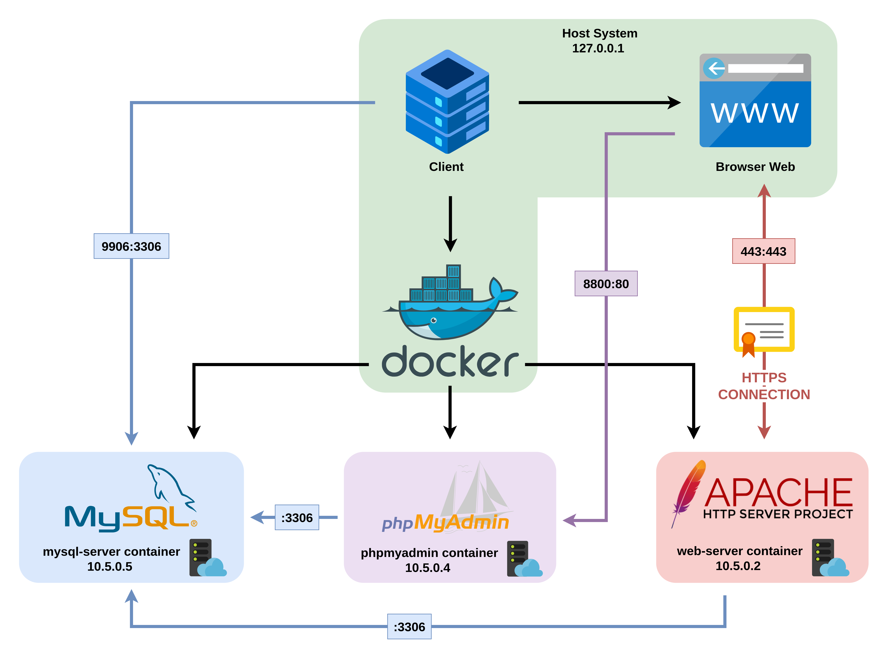

# Secure Book Selling Website


University project for **Systems and Network Hacking** course (MSc Computer Engineering at University of Pisa, A.Y. 2023-24)   

**BookSelling** is a Web Project that aims to simulate a **Secure E-Commerce Website**.  
In terms of **Security**, the website uses the **HTTPS** protocol to ensure communication in an **Encrypted** connection.  
It is also **Protected** against **several categories of vulnerabilities**, such as:
- ***Broken authentication***
- ***Broken access controls***
- ***SQL injection***
- ***Cross-site scripting (XSS)***
- ***Information leakage***
- ***Cross-site request forgery (XSRF)***

## System Architecture



## System Configuration

* In order to load the system execute:

```
./handle_services.sh start
```

This command will also start all the services.  
p.s. remember to give executable permission to the script with ```chmod +x handle_service.sh```

* To stop all the services:

```
./handle_services.sh stop
```

* To see the status of the container:

```
./handle_services.sh status
```

## Website and Services Access

* Add this rule in the ```/etc/hosts``` file:

```
127.0.0.1 www.bookselling.snh
```

* To access the WebSite type the following URL in the browser:

```
www.bookselling.snh
```

* To access the PhpMyAdmin Portal type the following URL in the browser:

```
localhost:8800
```

* To access the MYSQL DB with a client use these settings:
```
host: localhost
port: 9906
user: root or the one in the .env file
password: in the .env file
database: in the .env file
```
## SSL/TLS Certificates Generation

* In order to generate the certificates execute:

```
cd apache_conf/ssl_conf/certificates
./config_certificates.sh
```
p.s. remember to give executable permission to the script with ```chmod +x config_certificates.sh```

* After this import the SNH_CA.pem in ```apache_conf/ssl_conf/certificates``` in the browser
